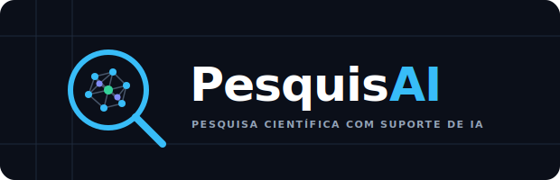

#  

[](https://colab.research.google.com/github/gustavobraga-byte/PesquisAI/blob/main/PesquisAI.ipynb)

[](LICENSE)
[](https://www.python.org/)
[]()
[](http://sisppg.ufv.br)
[]()

> Ecossistema de agentes de IA para acelerar a pesquisa científica.

---

## 📑 Sumário

- [Visão geral](#-visão-geral)
- [Capacidades](#-capacidades)
- [Início rápido](#-início-rápido)
- [Skills disponíveis](#-skills-disponíveis)
- [Roadmap](#-roadmap)
- [Arquitetura](#-arquitetura)
- [Limitações](#-limitações)
- [Citação](#-citação)
- [Declaração de uso de IA](#-declaração-de-uso-de-ia)
- [Disclaimer](#-disclaimer)
- [Como contribuir](#-como-contribuir)
- [Contato](#-contato)

---

## 🧠 Visão geral

O **PesquisAI** é um agente de Inteligência Artificial construído sobre a arquitetura **OpenCode**, projetado especificamente para pesquisadores, acadêmicos e cientistas. Ele automatiza etapas que vão do levantamento bibliográfico à estruturação de artigos, integrando fontes de dados públicos do Brasil.

> **🚨 Atenção:** O PesquisAI é uma ferramenta de apoio — **não substitui** a curadoria humana. Sempre revise os resultados gerados.

---

## ✨ Capacidades

| Área | O que faz |
|------|-----------|
| 📊 **Dados IBGE** | Consulta e extração de dados estatísticos, demográficos e socioeconômicos |
| 🏥 **DataSUS** | Acesso e análise de dados públicos de saúde (mortalidade, internações, vacinação) |
| 🌾 **Agro & Ambiente** | Dados do agronegócio brasileiro e cadastro ambiental rural (CAR) |
| 🇧🇷 **Dados Brasil** | Conjunto amplo de indicadores e datasets oficiais brasileiros |
| 📚 **Pesquisa científica** | Mineração de textos, revisão bibliográfica e suporte metodológico |
| ✍️ **Redação acadêmica** | Auxílio na estruturação e revisão de artigos científicos |
| 🔬 **Análise qualitativa** | Métodos clássicos e avançados (Reinert, similitude, codificação) |
| 📐 **Normas ABNT/UFV** | Formatação e normalização de trabalhos acadêmicos |

---

## 🚀 Início rápido

### Opção 1 — Google Colab (recomendada)

Sem instalação, pronto em ~2 minutos:

1. Clique no badge do Colab abaixo  
   [](https://colab.research.google.com/github/gustavobraga-byte/PesquisAI/blob/main/PesquisAI.ipynb)

2. No menu do Colab, vá em **Ambiente de execução → Executar tudo** (`Ctrl+F9`)

3. Role até a última célula e clique em **🤖 Abrir o PesquisAI**

### Opção 2 — Instalação local

```bash
git clone https://github.com/gustavobraga-byte/PesquisAI.git
cd PesquisAI
uv sync
# ... (consulte o MANUAL.md para detalhes)
```

---

## 🛠️ Skills disponíveis

O PesquisAI opera por módulos especializados (*skills*). Cada skill conecta o agente a uma fonte de dados ou capacidade específica.

| Skill | Descrição | Autor |
|-------|-----------|-------|
| `skill-ibge` | Consulta automatizada à API do IBGE (Censo, PNAD, PIB, etc.) | [@gustavobraga-byte](https://github.com/gustavobraga-byte) |
| `skill-datasus` | Integração com OpenDataSUS (mortalidade, internações, vacinação) | [@gustavobraga-byte](https://github.com/gustavobraga-byte) |
| `skill-UFV-ABNT` | Formatação segundo normas UFV/ABNT | [@gustavobraga-byte](https://github.com/gustavobraga-byte) |
| `skill-analise-qualitativa` | Análise de conteúdo com métodos clássicos e avançados (NVivo-like) | [@gustavobraga-byte](https://github.com/gustavobraga-byte) |
| `scientific-skills` | Mineração de textos, revisão bibliográfica, suporte metodológico | [@K-Dense-AI](https://github.com/K-Dense-AI) |
| `skill-dados-brasil` | Indicadores e datasets oficiais complementares | [@gustavobraga-byte](https://github.com/gustavobraga-byte) |
| `skill-agrobr` | Dados do agronegócio (produção, pecuária, CAR) | [@gustavobraga-byte](https://github.com/gustavobraga-byte) |
| `skill-obsidian-memory` | Memória persistente via Obsidian vault no Google Drive 🧠 | [@gustavobraga-byte](https://github.com/gustavobraga-byte) |

---

## 🗺️ Roadmap

| Fase | Período | Foco |
|------|---------|------|
| **1 — Base sólida** | Meses 1–3 | CLI, testes, CI/CD, instalação local |
| **2 — Expansão de dados** | Meses 4–7 | Novas skills: IPEA, INEP, Sucupira/CAPES, plugins |
| **3 — Interface** | Meses 8–11 | Interface web aprimorada, editor de artigos, copilot |
| **4 — Ecossistema** | Meses 12–18 | API pública, versão SaaS, integração institucional |

---

## ⚙️ Arquitetura

O PesquisAI usa **ttyd** para renderizar um terminal Linux interativo no navegador via Google Colab, com o ecossistema OpenCode injetado:

```
Google Colab
└── ttyd (terminal web na porta 8000)
    └── opencode (runtime do agente)
        ├── skill-ibge
        ├── skill-datasus
        ├── skill-dados-brasil
        ├── skill-agrobr
        ├── skill-UFV-ABNT
        ├── skill-analise-qualitativa
        ├── scientific-skills
        ├── skill-obsidian-memory  ← memória persistente (v0.5.0+)
        └── pesquisai (instruções do agente)
```

Dependências gerenciadas pelo [uv (Astral)](https://github.com/astral-sh/uv) para instalação rápida e reproduzível.

---

## ⚠️ Limitações

O PesquisAI **não substitui** o julgamento humano e apresenta as seguintes limitações:

- ❌ **Não** realiza revisão por pares nem validação científica profunda.
- ❌ **Não** acessa bases pagas sem integração específica.
- ❌ **Não** coleta dados primários (entrevistas, experimentos, surveys).
- ❌ **Não** garante atualização em tempo real — depende das APIs externas.
- ❗ **Alucinações possíveis:** sempre verifique os resultados com fontes confiáveis.

---

## 📚 Citação

**ABNT NBR 6023:2018:**

```
BRAGA, Gustavo Bastos. PesquisAI: agente de inteligência artificial para pesquisa
científica. Versão 0.5.1.5. Viçosa: Universidade Federal de Viçosa, 2026.
Disponível em: https://colab.research.google.com/github/gustavobraga-byte/PesquisAI/.
Acesso em: DD mês. AAAA.

Projeto registrado no SisPPG/UFV sob nº 10356285004.
Verificar autenticidade em: http://sisppg.ufv.br
```

**BibTeX:**

```bibtex
@software{braga2026pesquisai,
  author       = {Gustavo Bastos Braga},
  title        = {{PesquisAI}: Agente de Intelig{\^e}ncia Artificial
                  para Pesquisa Cient{\'\i}fica},
  year         = {2026},
  version      = {0.5.1.5},
  institution  = {Universidade Federal de Vi{\c{c}}osa (UFV)},
  url          = {https://colab.research.google.com/github/gustavobraga-byte/PesquisAI/}
}
```

---

## 🤖 Declaração de uso de IA

O uso do PesquisAI em trabalhos acadêmicos **deve ser declarado** conforme diretrizes do COPE, CAPES e principais periódicos. Consulte o arquivo [`declaracao_uso_ia.md`](declaracao_uso_ia.md) para modelos prontos (ABNT, ICMJE, Nature, Science, Elsevier, Springer).

---

## ⚖️ Disclaimer

O PesquisAI é um **software experimental fornecido "como está"**, sem garantias. LLMs podem **alucinar** — é responsabilidade exclusiva do usuário validar todos os dados, análises e referências gerados. Consulte o [`disclaimer_pesquisai.md`](disclaimer_pesquisai.md) para os termos completos.

---

## 🤝 Como contribuir

Contribuições são bem-vindas — especialmente novas skills para fontes de dados públicos brasileiros.

```bash
# 1. Fork e clone
git clone https://github.com/SEU_USUARIO/PesquisAI.git

# 2. Crie uma branch
git checkout -b feature/nova-skill

# 3. Desenvolva, teste e abra um Pull Request
```

Consulte o [`AGENTS.md`](AGENTS.md) para entender a arquitetura das skills.

**Ideias de contribuição:**
- Skills para IPEA, INEP, ANEEL, ANS, IBICT, etc.
- Melhorias na skill científica (SciELO, BDTD)
- Traduções da documentação
- Casos de uso e exemplos práticos

---

## 📬 Contato

Desenvolvido por **Gustavo Bastos Braga** na Universidade Federal de Viçosa (UFV).

- ✉️ gustavo.braga@ufv.br
- 🐙 [@gustavobraga-byte](https://github.com/gustavobraga-byte)

---

Feito com 💙 para impulsionar a ciência brasileira.
```
